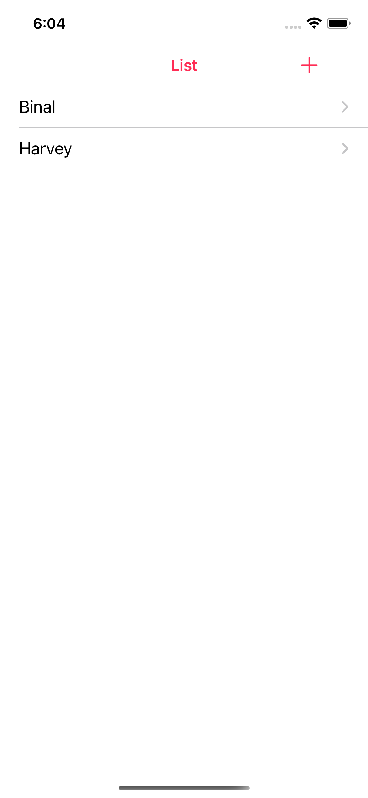

#Introduction
RemindMe app is a simple example of database connectivity by storing details of your friend.

#Requirements
Xcode 13 or above

#Configuration
Steps to implement PageViewController , Json Parsing and Share Functionality
DisplayDataList Controller
Display list of your contacts by implementing UITableViewDelegate, UITableViewDataSource delegated methods which are numberOfRowsInSection, cellForRowAt, commitForRowAt, didSelectRowAt

## InputDataForm
    To store data of your contact here is a form which accepts data and store it to database using Sqlite,
     1.Here Email is a Primary field
     2.Here Name, Relation, DOB, Phone and Email are mandatory fields
     3.Here Phone and Email validations are implemented 

## DBFunctions
This file contains database functions like OpenDatabase, CreateTable, Insert, Update ,Delete, Read

  
   
  
  

![][image_ref_a32ff4ads]
